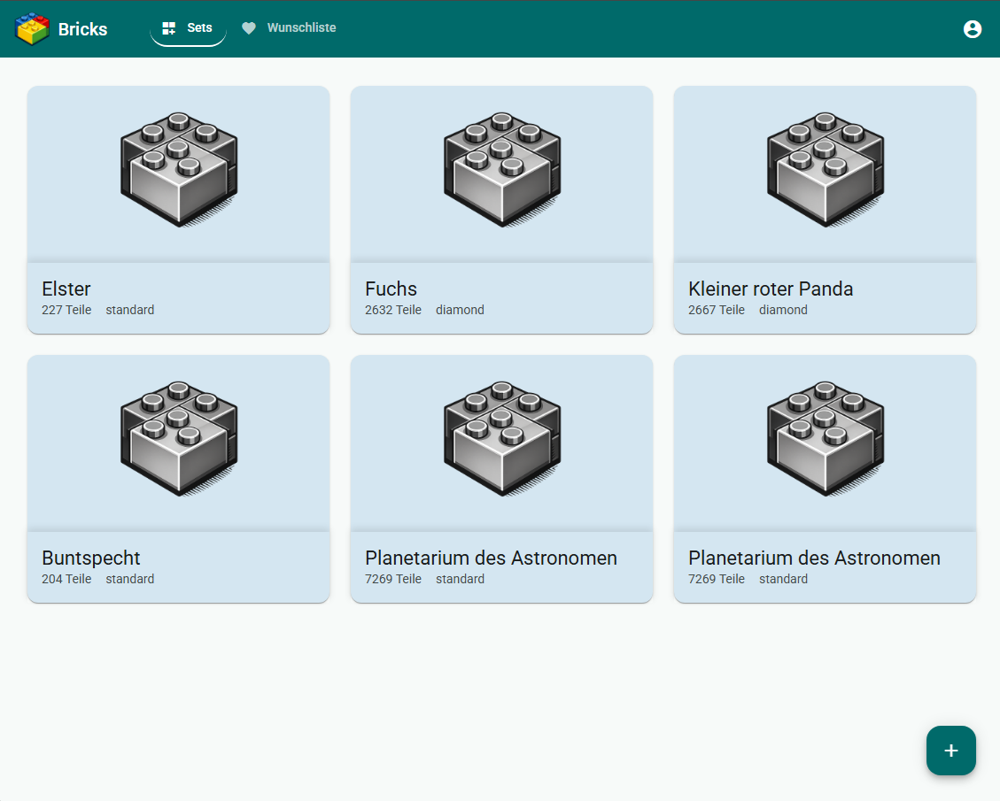

# Bricks Frontend

Web app for managing your brick sets, built with Angular and Angular Material.

## Preview


## Tech Stack

- **Framework:** Angular 21
- **UI Library:** Angular Material
- **Language:** TypeScript
- **Styling:** SCSS

## Getting Started

### Prerequisites

- Node.js 20+
- Angular CLI 21

```bash
npm install -g @angular/cli@21
```

### Installation

```bash
npm install
```

### Environment Variables

The API URL is configured in `src/environments/environment.ts`:

```typescript
export const environment = {
  production: false,
  apiUrl: 'http://localhost:3000',
};
```

### Development

```bash
ng serve
```

Open [http://localhost:4200](http://localhost:4200) in your browser.

### Production Build

```bash
ng build
```

## Project Structure

```
src/app/
├── core/               # Services, models, guards
│   ├── models/         # TypeScript interfaces
│   └── services/       # API services
├── features/           # Feature modules
│   └── products/       # Products feature
│       ├── components/ # Product-specific components
│       ├── product-form/
│       └── products-list/
└── shared/             # Shared components
    └── components/
        ├── header/
        └── product-card/
```
